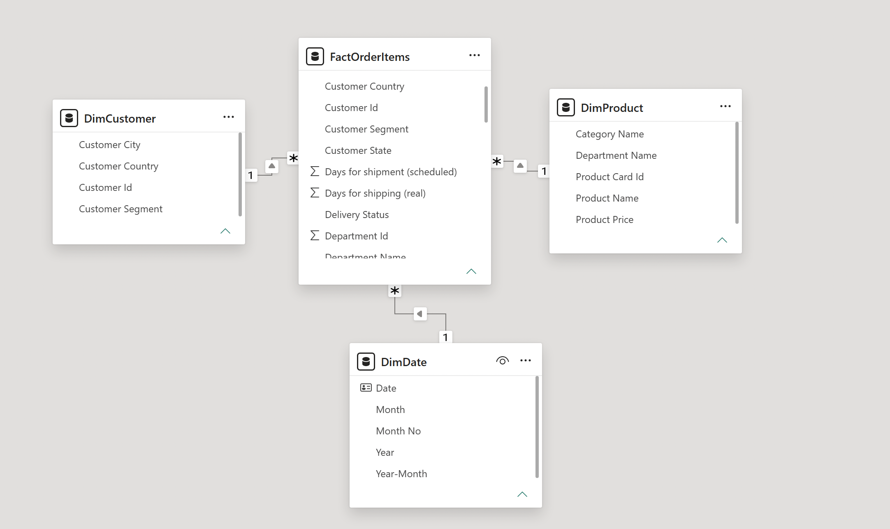
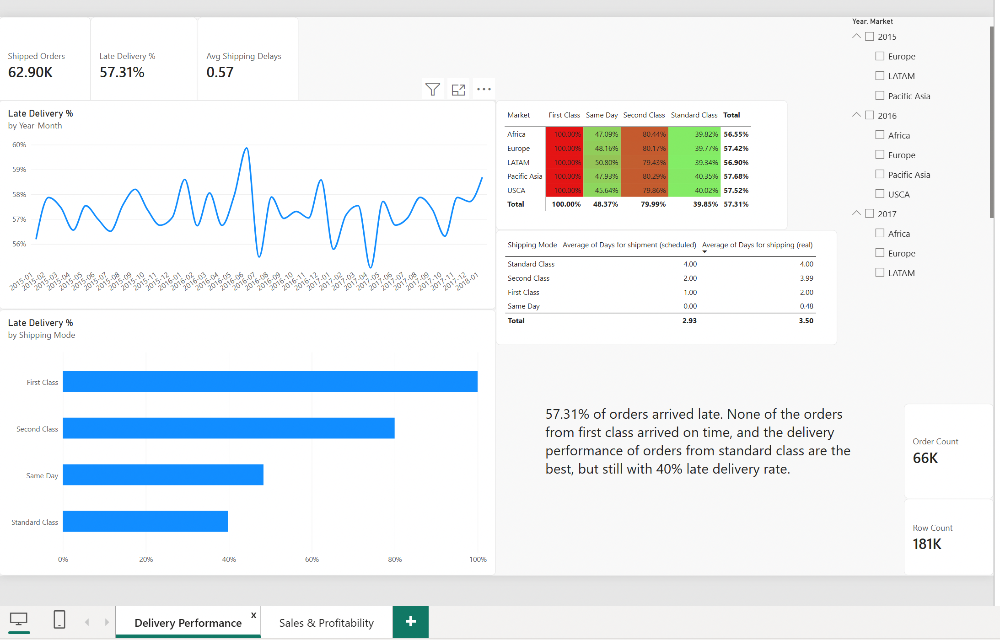
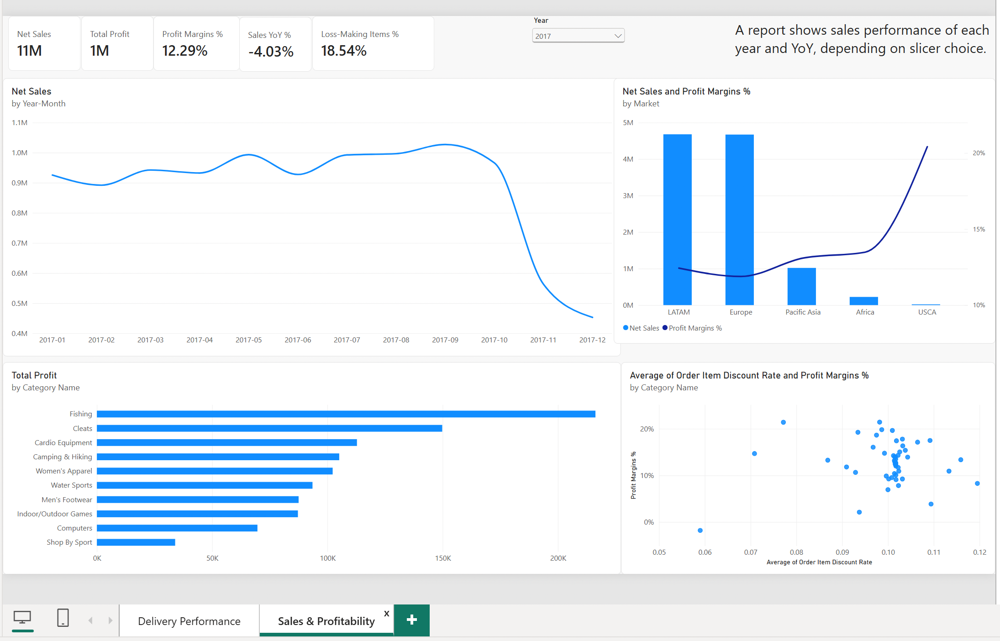

# DataCo Supply Chain Delivery & Profitability Dashboard

A Power BI report on 181,000 order lines from a global supply chain operation, built to answer three key operational questions: are we delivering on time, where do we make money, and which way are the numbers moving.

---

## Business questions

1. **Delivery** — How often are we late, and which shipping modes and markets cause it?
2. **Profitability** — Where do we make or lose money, and does discounting hurt margin?
3. **Trend** — How do sales develop year over year?

---

## Data

Source |  [DataCo Smart Supply Chain (Kaggle)](https://www.kaggle.com/datasets/shashwatwork/dataco-smart-supply-chain-for-big-data-analysis)

Size | 181k rows, 53 columns

Period | January 2015 – January 2018

Scope | 5 markets, 50 product categories, 4 shipping modes

**Grain: one row is one order item, not one order.** 181k rows map to 66k orders — an average of 2.7 items per order. Order counts therefore use `DISTINCTCOUNT(Order Id)`; counting rows would overstate order volume by nearly 3x. Revenue fields are recorded per line, so those are summed.

---

## Approach

**Power Query** — Parsed US-format dates with an explicit locale setting, since the default regional setting silently swaps day and month. Dropped unused and personal columns (email, password, image links). Derived two fields the raw data does not contain: shipping delay in days (actual minus scheduled) and a late-delivery flag.

**Data model** — Star schema: one fact table of order items, with product, customer and date dimensions. All relationships are one-to-many with single-direction filtering. The date table is generated in DAX and marked as a date table so time intelligence works.

**DAX** — 13 measures grouped into delivery, sales, volume and time intelligence. Cancelled orders are excluded from the delivery denominator inside the measure rather than filtered out during cleaning, so the underlying data stays complete and the exclusion is visible in the code. Findings were checked against the underlying distribution rather than taken from the aggregate — the 100% figure was confirmed by listing actual transit days per shipping mode before it was written up.

---

## Key insights

**1. First Class is late on 100% of shipments — the promise seems to be the problem.**

Scheduled lead time for First Class is 1 day, while actual shipping averages 2 days. The commitment is not achievable under current operations. Standard Class, with a 4-day promise, is late only 39.85% of the time on the same network.

Resetting the First Class promise from 1 day to 2 would move on-time delivery from 0% to 100%, since every First Class shipment arrives in 
exactly 2 days. The alternative — keeping the promise and fixing the network — would require cutting a full day off the average transit time.

**2. [填: 品类/市场] generates [填: X]% of revenue but runs the thinnest margin at [填: X]%.**

[填: 写你从 Market 对比图和 Top 10 品类利润图里看到的。哪个市场或品类卖得多但不赚钱？哪个品类是亏的？]

**3. [填: X]% of order lines are sold at a loss, and discount depth explains part of it.**

[填: 写你从折扣散点图里看到的。折扣率高的品类，利润率是不是明显更低？有没有例外？]

---

## Dashboard

**Page 1 — Delivery Performance**

Late-delivery rate by shipping mode and market, with scheduled versus actual transit days side by side so the gap between promise and performance is visible rather than inferred.

**Page 2 — Sales & Profitability**

Revenue and margin by market and category, a discount-versus-margin scatter, and year-over-year comparison. [填: 说明截图里选的是哪一年，比如 "Filtered to 2017; 2018 holds one month of data only."]

---

## Validation

Every delivery figure was recalculated independently in Excel with a PivotTable. The two numbers differ, and the difference is itself informative:

| Method | Late delivery rate |
|---|---|
| Excel — average of the late flag across 181k order lines | [填: X]% |
| Power BI — late orders ÷ shipped orders, de-duplicated to order level, cancellations excluded | [填: X]% |

The gap comes from grain and scope: Excel averages over lines, the measure counts distinct orders and drops cancelled shipments. Neither is wrong, but a report that quotes one while a spreadsheet quotes the other will not survive a review meeting.

---

## Limitations

- Transit times show no variation within a shipping mode — every First Class shipment takes exactly 2 days. Real operations have a distribution; this is an artefact of simulated data. The planning-versus-execution distinction still holds, but the 0%-to-100% figure would be a range in practice.
- Data ends 31 January 2018 and that month is partial. The drop at the end of the trend line is the cutoff, not a decline.
- 2015 has no prior year in the data, so year-over-year is blank for it.
- Location names are partly in Spanish, which limits map-based analysis; geographic cuts use market and region instead.
- The dataset is simulated. The method transfers; the specific numbers describe this dataset only.
- Data ends 31 January 2018 and that month is partial. The drop at the end of the trend line is the cutoff, not a decline.
- 2015 has no prior year in the data, so year-over-year is blank for it.
- Location names are partly in Spanish, which limits map-based analysis; geographic cuts use market and region instead.
- The dataset is simulated. The method transfers; the specific numbers describe this dataset only.

---

## Files

| File | |
|---|---|
| `dataco_supply_chain.pbix` | Power BI report — open in Power BI Desktop |
| `dataco_supply_chain.pdf` | Static export, no software needed |
| `dataco_crosscheck.xlsx` | Excel PivotTable validation |

Raw data is not included — download it from the Kaggle link above.

---

**Built with** Power BI Desktop (Power Query, DAX), Excel
